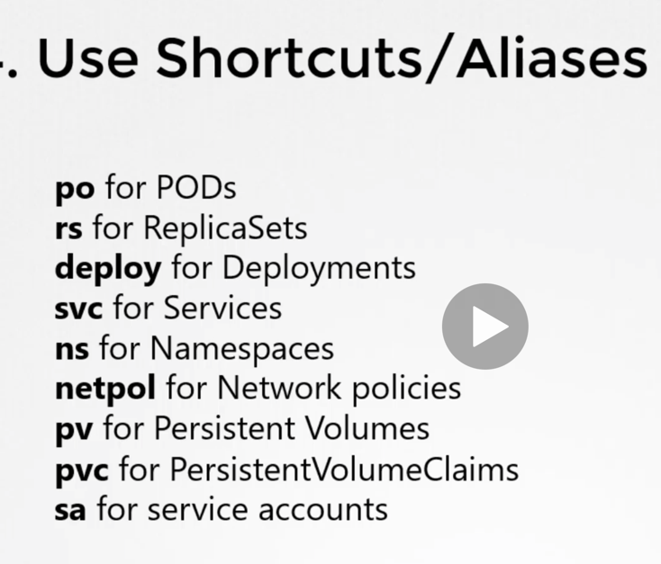

# k8s-notes
Kubernetes notes and commands
- https://afkham-azeez.medium.com/passing-ckad-tips-tricks-e24712f3e4a4
- CKAD 
  - Udemy Course: https://www.udemy.com/course/certified-kubernetes-application-developer/
  - https://dzone.com/articles/kubernetes-for-application-developers-ckad
    - experience: https://github.com/IvoNet/CKAD-resources
- Cheatsheet:
  - https://github.com/dennyzhang/cheatsheet-kubernetes-A4/blob/master/cheatsheet-kubernetes-A4.pdf
- Autocompletion: 
  - https://kubernetes.io/docs/tasks/tools/install-kubectl-macos/
## General

-- Get a list of all the k8s objects
- kubectl get all -A    

-- Get objects in namespace
kubectl get all -n namespace_name

-- getting help
- kubectl explain persistentvolume --recursive | less
- Cert tips
- attempt all questions 
- dont get stuck 
- Use shortcuts/ aliases

- Additional tips
  - https://www.youtube.com/watch?v=rnemKrveZks&ab_channel=MuralidaranShanmugham

- find which node pods are running on 
  - kubectl get pods -o wide
- What does the READY column in the output of the kubectl get pods command indicate?
  - Running containers in the pod/ Total containers in the pod
  


### Get pods 
``` kubectl get pods ```

### ReplicaSets 
- replicaset ensures that desired number of pods are always run
- kubectl get rs
- kubectl get rs new-replica-set -o yaml | less
- kubectl edit rs new-replica-set
- kubectl scale replicaset
- kubectl edit replicaset
- Look up syntax
  - kubectl explain replicaset | grep VERSION
```yaml
apiVersion: apps/v1
kind: ReplicaSet
metadata:
  name: replicaset-2
spec:
  replicas: 2
  selector:
    matchLabels:
      tier: nginx
  template:
    metadata:
      labels:
        tier: nginx
    spec:
      containers:
      - name: nginx
        image: nginx
```

### Deployments
- kubectl get deployments
- kubectl describe deployment name 
- kubectl edit deployment name 
  - Change image name
  - change deployment strategy 
- kubectl create -f deployment-definition-httpd.yaml
```yaml
apiVersion: apps/v1
kind: Deployment
metadata:
  name: httpd-frontend
spec:
  replicas: 3
  selector:
    matchLabels:
      name: httpd-frontend
  template:
    metadata:
      labels:
        name: httpd-frontend
    spec:
      containers:
      - name: httpd-frontend
        image: httpd:2.4-alpine

```

### ConfigMap 
- kubectl create configmap webapp-config-map --from-literal=APP_COLOR=darkblue
 ```yaml 
  spec:
  containers:
  - envFrom:
    - configMapRef:
      name: webapp-config-map
  ```
  
### Secret
- kubectl create secret generic db-secret --from-literal=DB_Host=sql-1 --from-literal=DB_User=root --from-literal=DB_Password=password123
```yaml
spec:
  containers:
    - image: kodekloud/simple-webapp-mysql
      envFrom:
        - secretRef:
            name: db-secret
```

### namespaces
- How many pods exist in the research namespace
  - kubectl get pods -n research  
- kubectl run redis --image=redis -n finance
  - kubectl run redis --image=redis -n finance
- Which namespace has the pod blue 
  - kubectl get pods --all-namespaces | grep blue
### imperative commands 
- Create pod with the image given
  - kubectl run podtest --image=nginx
  - kubectl run nginx-pod --image nginx:alpine
- Create pod and add a label 
  - kubectl run redis --image redis:alpine
  - kubectl label pod redis tier=db
- Create a service redis-service to expose application within the cluster on the port 6379
  - kubectl expose pod redis --port=6379 --name=redis-service
- Create Deployment
  - kubectl create deployment webapp --image=kodekloud/webapp-color --replicas=3
- Create a new pod called custom-nginx using the nginx image and expose it on container port 8080
  - kubectl run custom-nginx --image=nginx --port=8080
- Create a new name namespace
  - kubectl create ns dev-ns
- Create a new deployment called redis-deploy in the dev-ns namespace with the redis image. It should have 2 replicas.
  - kubectl create deployment redis-deploy -n dev-ns --image=redis --replicas=2
- Create a pod called httpd using the image httpd:alpine in the default namespace. Next, create a service of type ClusterIP by the same name (httpd). The target port for the service should be 80.
- ```yaml 
  root@controlplane:~# kubectl run httpd --image httpd:alpine --port 80 --expose
  service/httpd created
  pod/httpd created
  ```
### Logs
- kubectl logs pod-name

### Jobs
- kubectl get jobs
- kubectl get cronjob
- kubectl delete job throw-dice-job

```
apiVersion: batch/v1
kind: Job
metadata:
        name: throw-dice-job
spec:
        backoffLimit: 25
        completions: 3
        parallelism: 3
        template:
                spec:
                         containers:
                                 - image: kodekloud/throw-dice
                                   name: throw-dice-job
                         restartPolicy: Never
 ```
 - Creating Cron Job
 ```
 apiVersion: batch/v1beta1
kind: CronJob
metadata:
        name: throw-dice-job
spec:
        schedule: "30 21 * * *"
        jobTemplate:
                spec:
                         backoffLimit: 25
                         completions: 3
                         parallelism: 3
                         template:
                                spec:
                                  containers:
                                      - image: kodekloud/throw-dice
                                        name: throw-dice-job
                                  restartPolicy: Never
 ```


### Services
- Services enables communication between group of pods
- promotes loose coupling between pods
- listens on port on node and forward traffic to pod
- Nodeports Service type
  - service port aka targetPort
  - nodePort
  - port 
- service acts as a built in load balancer
- cluster ip service type
        - targetPort: 80
        - port: 80
- service layer can assign port number greather that 30000
- Describe service in a namespace 
  - kubectl describe service db-service -n dev
#### commands
        - kubectl get services
        - kubectl describe service kubernetes
        - kubectl edit service kubernetes
        - kubectl get endpoints
        - kubectl expose deployment name --name=svc-name --target-port=8080 --port=8080  --node-port=30080 --type=Nodeport --dry-run=client -o yaml > svc.yaml

- Ingress
- kubectl get ingress --all-namespaces
- kubectl describe ingress --namespace app-space
- kubectl edit ingress --namespace app-space
- kubectl get deployments -n app-space
- kubectl get svc -n critical-space

```
apiVersion: networking.k8s.io/v1
kind: Ingress
metadata:
  name: test-ingress
  namespace: critical-space
  annotations:
    nginx.ingress.kubernetes.io/rewrite-target: /
    nginx.ingress.kubernetes.io/ssl-redirect: "false"
spec:
  rules:
  - http:
      paths:
      - path: /pay
        pathType: Prefix
        backend:
          service:
           name: pay-service
           port:
            number: 8282


```

kubectl get deployments.apps --all-namespaces
kubectl get ingress --all-namespaces
kubectl describe ingress 
kubectl describe -n app-space ingress name
kubectl get deployments.apps,svc 
kubectl get deployments.apps --all-namespaces

kubectl create ns ingress-space
kubectl create configmap nginx-configuration --namespace ingress-space
kubectl create serviceaccount ingress-serviceaccount --namespace ingress-space

kubectl get serviceaccounts -n ingress-space

```
apiVersion: apps/v1
kind: Deployment
metadata:
  name: ingress-controller
  namespace: ingress-space
spec:
  replicas: 1
  selector:
    matchLabels:
      name: nginx-ingress
  template:
    metadata:
      labels:
        name: nginx-ingress
    spec:
      serviceAccountName: ingress-serviceaccount
      containers:
        - name: nginx-ingress-controller
          image: quay.io/kubernetes-ingress-controller/nginx-ingress-controller:0.21.0
          args:
            - /nginx-ingress-controller
            - --configmap=$(POD_NAMESPACE)/nginx-configuration
            - --default-backend-service=app-space/default-http-backend
          env:
            - name: POD_NAME
              valueFrom:
                fieldRef:
                  fieldPath: metadata.name
            - name: POD_NAMESPACE
              valueFrom:
                fieldRef:
                  fieldPath: metadata.namespace
          ports:
            - name: http
              containerPort: 80
            - name: https
              containerPort: 443

```

- Create service
kubectl expose deployment ingress-controller --type=NodePort --port=80 --name=ingress --dry-run=client -o yaml > ingress.yaml

```
apiVersion: v1
kind: Service
metadata:
  name: ingress
  namespace: ingress-space
spec:
  type: NodePort
  ports:
  - port: 80
    targetPort: 80
    protocol: TCP
    nodePort: 30080
    name: http
  - port: 443
    targetPort: 443
    protocol: TCP
    name: https
  selector:
    name: nginx-ingress

```

- Create ingress

```
apiVersion: networking.k8s.io/v1
kind: Ingress
metadata:
        name: ingress-wear-watch
        namespace: app-space
        annotations:
                nginx.ingress.kubernetes.io/rewrite-target: /
                nginx.ingress.kubernetes.io/ssl-redirect: "false"
spec:
        rules:
                - http:
                        paths:
                                - path: /wear
                                  pathType: Prefix
                                  backend:
                                          service:
                                                  name: wear-service
                                                  port:
                                                          number: 8080
                                - path: /watch
                                  pathType: Prefix
                                  backend:
                                          service:
                                                  name: video-service
                                                  port:
                                                          number: 8080

```

- check role binding

  - kubectl -n ingress-space get roles.rbac.authorization.k8s.io
  - kubectl -n ingress-space get rolebindings.rbac.authorization.k8s.io

- Mount volume
- kubectl run webapp --image=kodekloud/event-simulator --dry-run=client -o yaml > o.yaml
```
apiVersion: v1
kind: Pod
metadata:
  labels:
    run: webapp
  name: webapp
spec:
  volumes:
          - name: log-volume
            hostPath:
              path:  /var/log/webapp
              type: Directory
  containers:
  - image: kodekloud/event-simulator
    name: webapp
    volumeMounts:
            - mountPath: /log
              name: log-volume
```

- Create Persistent Volume
```

apiVersion: v1
kind: PersistentVolume
metadata:
        name: pv-log
spec:
        persistentVolumeReclaimPolicy: Retain
        accessModes:
                - ReadWriteMany
        capacity:
                storage: 100Mi
        hostPath:
                path: /pv/log
~                                                                                                                             

```

- Create Persistent Volume Claim 
- kubectl describe persistentVolumeClaim claim-log-1
- kubectl describe pvc claim-log-1
- kubectl delete pvc claim-log-1

```
kind: PersistentVolumeClaim
apiVersion: v1
metadata:
        name: claim-log-1
spec:
        accessModes:
                - ReadWriteMany
        resources:
                 requests:
                         storage: 50Mi

```

