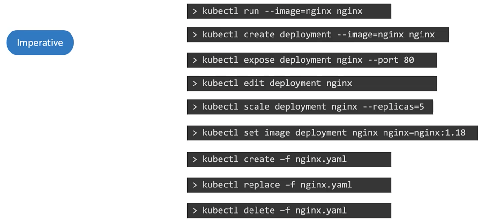
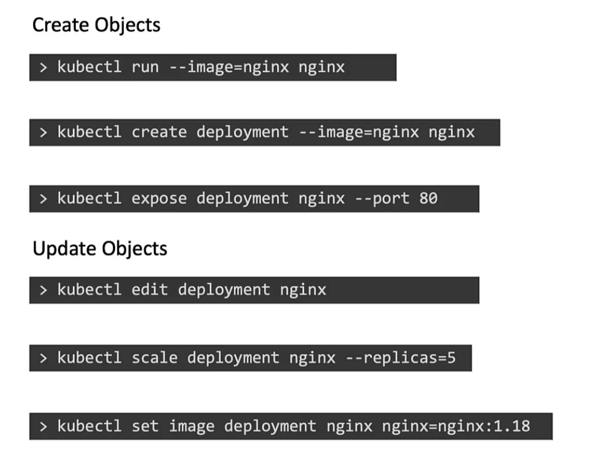
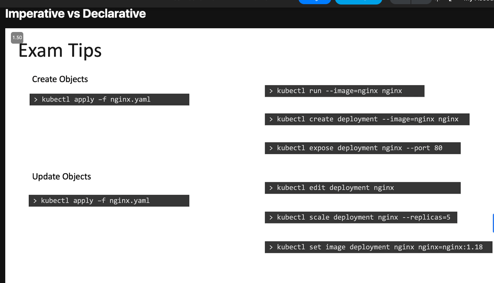

## Exam 

### Killercoda
https://killercoda.com/killer-shell-cka

### KillerShell
- https://github.com/David-VTUK/CKA-StudyGuide/

### Read
- Kubernetes: Up and Running 3rd Edition
- Kubernetes in Action, Second Edition
- Cloud Native DevOps with Kubernetes

#### General 
- Log locations 
  - `/var/log/pods`
  - `/var/log/containers`
  - `crictl ps`  `docker ps`
  - `crictl logs` `docker logs`
  - kubelet logs: `/var/log/syslog` or `journalctl`
- The kubelet cannot even create the Pod/Container. Check the kubelet logs in syslog for issues. 
  - ``cat /var/log/syslog | grep kube-apiserver``
- Restart kubelet: `service restart kubelet`

### etcd Database
- Key value store
- Stores everything about cluster: nodes, pods, configs, secret, accounts, roles, bindings, other
- Default port 2379
### Kube API Server
- authenticates, validates request, retrieve/update request data to/from etcd

### Kube Controller Manager
- Controller monitors  continuously state of various components and work towards bringing them to the desired 
Certification Tips – Imperative Commands with Kubectl
While you would be working mostly the declarative way – using definition files, imperative commands can help in getting one time tasks done quickly, as well as generate a definition template easily. This would help save considerable amount of time during your exams.

Before we begin, familiarize with the two options that can come in handy while working with the below commands:

--dry-run: By default as soon as the command is run, the resource will be created. If you simply want to test your command , use the --dry-run=client option. This will not create the resource, instead, tell you whether the resource can be created and if your command is right.

-o yaml: This will output the resource definition in YAML format on screen.

Use the above two in combination to generate a resource definition file quickly, that you can then modify and create resources as required, instead of creating the files from scratch.

Pods can not be moved to new node. Delete pod and recreate it on another node.
Editing pod also does not work

#### DaemonSets 
- Run the command `kubectl get daemonsets --all-namespaces`

#### Remove the taint
`controlplane ~ ✖ k taint node controlplane node-role.kubernetes.io/control-plane:NoSchedule-`

## Cert Tips from KodeKloud CKA Course 
#### POD

* Create pod w labels 
- `kubectl run redis -l tier=db --image=redis:alpine`

* Create an NGINX Pod
- `kubectl run nginx --image=nginx`

* Generate POD Manifest YAML file (-o yaml). Don’t create it(–dry-run)
- ` kubectl run nginx --image=nginx --dry-run=client -o yaml`

#### Deployment
* Create a deployment
 `kubectl create deployment --image=nginx nginx`

* Generate Deployment YAML file (-o yaml). Don’t create it(–dry-run)
 `kubectl create deployment --image=nginx nginx --dry-run=client -o yaml`

* Generate Deployment with 4 Replicas

* `kubectl create deployment nginx --image=nginx --replicas=4`

* You can also scale a deployment using the kubectl scale command.

* `kubectl scale deployment nginx --replicas=4`

* Another way to do this is to save the YAML definition to a file and modify

* `kubectl create deployment nginx --image=nginx --dry-run=client -o yaml > nginx-deployment.yaml`

* You can then update the YAML file with the replicas or any other field before creating the deployment.

#### Service
* Create a Service named redis-service of type ClusterIP to expose pod redis on port 6379
 `kubectl expose pod redis --port=6379 --name redis-service --dry-run=client -o yaml`
* (This will automatically use the pod’s labels as selectors)
* Or
 `kubectl create service clusterip redis --tcp=6379:6379 --dry-run=client -o yaml (This will not use the pods labels as selectors, instead it will assume selectors as app=redis. You cannot pass in selectors as an option. So it does not work very well if your pod has a different label set. So generate the file and modify the selectors before creating the service)`
* Create a Service named nginx of type NodePort to expose pod nginx’s port 80 on port 30080 on the nodes:
- `kubectl expose pod nginx --type=NodePort --port=80 --name=nginx-service --dry-run=client -o yaml`
(This will automatically use the pod’s labels as selectors, but you cannot specify the node port. You have to generate a definition file and then add the node port in manually before creating the service with the pod.)
* Or
- `kubectl create service nodeport nginx --tcp=80:80 --node-port=30080 --dry-run=client -o yaml`

* (This will not use the pods labels as selectors)

* Both the above commands have their own challenges. While one of it cannot accept a selector the other cannot accept a node port. I would recommend going with the `kubectl expose` command. If you need to specify a node port, generate a definition file using the same command and manually input the nodeport before creating the service.

* Reference:
* https://kubernetes.io/docs/reference/generated/kubectl/kubectl-commands

* https://kubernetes.io/docs/reference/kubectl/conventions/

### 
- Imperative commands

https://medium.com/bb-tutorials-and-thoughts/practice-enough-with-these-questions-for-the-ckad-exam-2f42d1228552 
